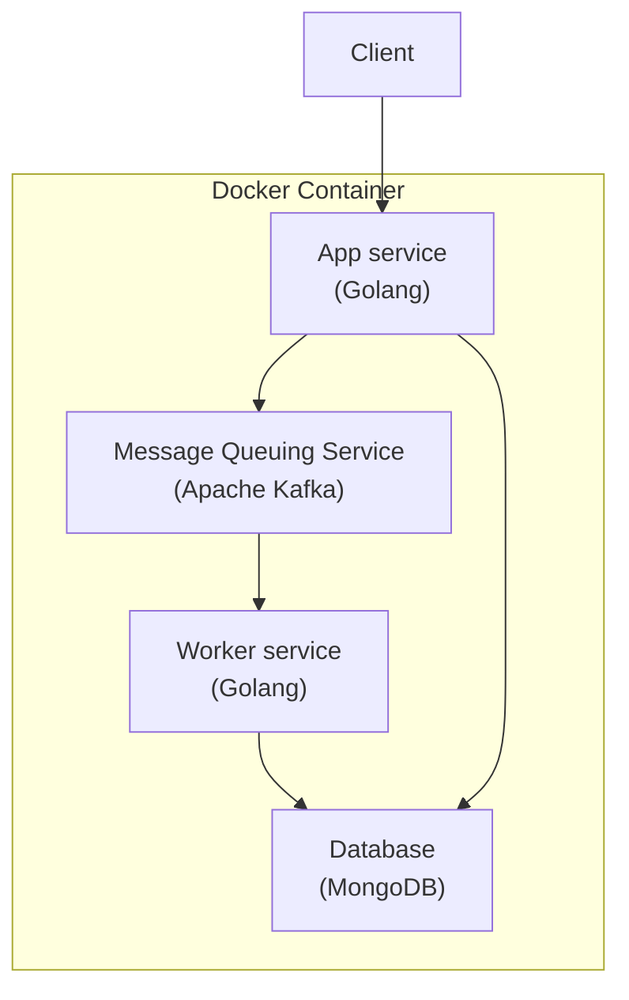

# Notification Feature

goal of this repository is to practice design notification feature for multi-tenant microservice architecture

- [ ] request api that create notification across tenant
- [ ] notification on user side can be read or unread
- [ ] basic crud tenant
- [ ] basic crud user

## Stack

- Docker
- Golang
- Kafka
- MongoDB

## Flow

